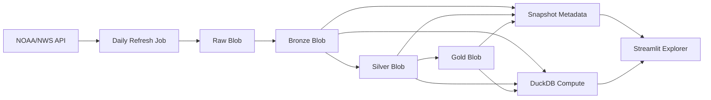

# Open Table Format Time Travel Audit Pipeline

This project is now optimized for a low-cost Azure deployment:

- Azure Blob Storage is the source of truth
- the Streamlit app is read-only
- a separate daily refresh job publishes new snapshots at most once every 24 hours
- DuckDB is used as stateless compute for queries and comparisons

## Dataset

The source is the official NOAA / National Weather Service observations API:

- [weather.gov API docs](https://www.weather.gov/documentation/services-web-api)
- [KJFK latest observation example](https://api.weather.gov/stations/KJFK/observations/latest)

Each record is a timestamped station observation with fields such as temperature, humidity, pressure, wind speed, and weather description. That makes it a good stand-in for continuously arriving telemetry.

## Architecture



## Project Layout

- `app.py`: Streamlit entrypoint
- `audit_pipeline/core/`: Bronze, Silver, Gold transforms
- `audit_pipeline/services/blob_store.py`: Azure Blob read/write helpers
- `audit_pipeline/services/source_nws.py`: official source ingestion
- `audit_pipeline/services/catalog_store.py`: snapshot metadata layer
- `audit_pipeline/services/snapshot_store.py`: parquet snapshot persistence in Blob
- `audit_pipeline/services/refresh_service.py`: daily refresh orchestration
- `audit_pipeline/services/query_service.py`: in-memory DuckDB SQL helpers
- `audit_pipeline/jobs/refresh_live_data.py`: scheduled writer job
- `audit_pipeline/ui/`: Streamlit UI
- `audit_pipeline/duckdb_audit.py`: ad hoc query CLI
- `audit_pipeline/time_travel_demo.py`: snapshot comparison CLI
- `docs/hosting.md`: Azure hosting guidance

## Storage Model

- `raw/...`
  landed official source pulls in Blob Storage
- `snapshots/bronze/...`
  raw-but-versioned telemetry parquet snapshots
- `snapshots/silver/...`
  cleaned and flagged parquet snapshots
- `snapshots/gold/...`
  aggregated parquet snapshots
- `metadata/catalog.json`
  full snapshot catalog
- `metadata/latest_snapshot.json`
  latest snapshot id, timestamps, row counts, and metrics

## App Behavior

The Streamlit app does not ingest data.

It only:

- reads the latest snapshot metadata
- loads selected historical and current snapshots
- compares them side by side
- runs predefined DuckDB queries in memory
- shows processing metrics

## Daily Refresh Behavior

The refresh job is the only writer.

It:

1. checks the latest published snapshot timestamp
2. skips refresh if the newest snapshot is less than 24 hours old
3. fetches official NOAA/NWS observations when due
4. writes raw, Bronze, Silver, and Gold parquet snapshots to Blob Storage
5. updates the metadata layer with latest snapshot id, timestamps, row counts, and metrics

Run it with:

```bash
python -m audit_pipeline.jobs.refresh_live_data
```

Force a refresh:

```bash
python -m audit_pipeline.jobs.refresh_live_data --force
```

## Environment Variables

- `AZURE_STORAGE_CONNECTION_STRING`
- `AZURE_BLOB_CONTAINER`
- `AUTO_REFRESH_MINUTES`
- `SNAPSHOT_CACHE_TTL_SECONDS`
- `NWS_USER_AGENT`

## Local Run

```bash
python -m venv .venv
.venv\Scripts\activate
pip install -r requirements.txt
streamlit run app.py
```

## Azure Recommendation

- host the Streamlit app on Azure Container Apps or Azure App Service
- host the daily refresh job separately
- use Azure Blob Storage for all persisted data

More detail is in [docs/hosting.md](C:/Users/nhvk5/OneDrive/Desktop/Data-Eng-Project/docs/hosting.md).
